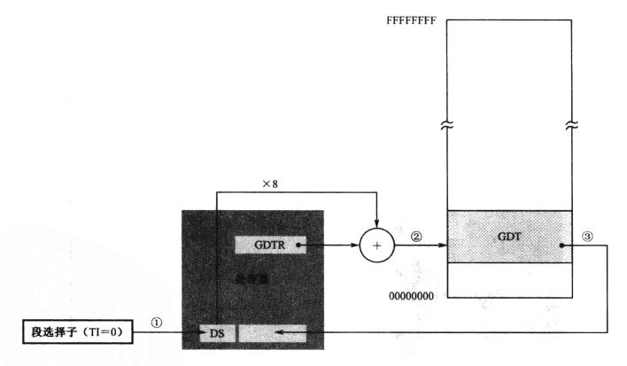
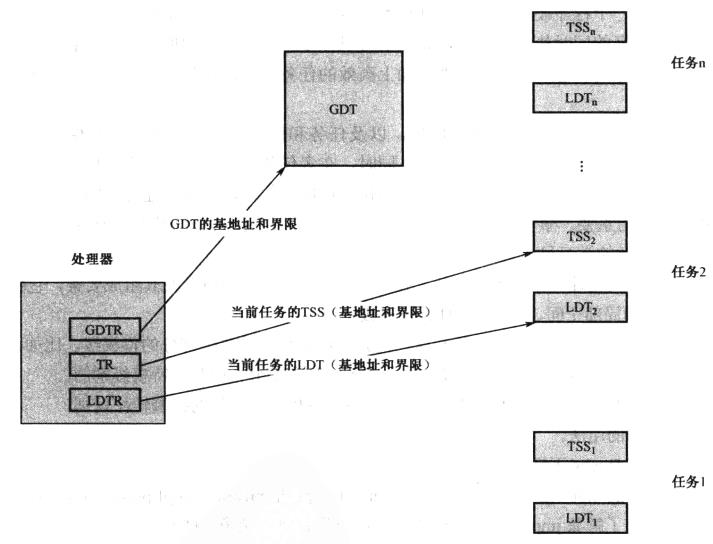
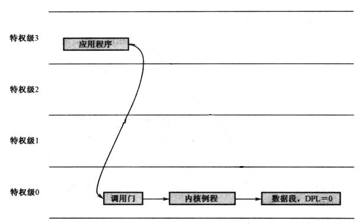
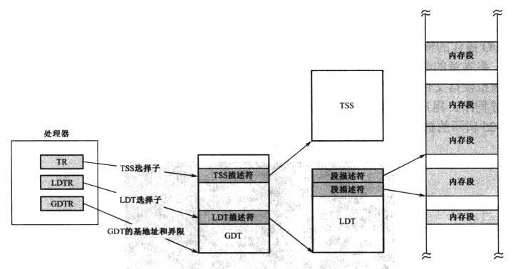

前面一篇总结了X86汇编中实模式的阅读笔记，这一篇总结一下保护模式的阅读笔记。

#### 32位X86处理器 ####

在32位处理器上，8个通用寄存器扩展为32位，段寄存器CS/SS/DS/ES扩展出描述符高速缓冲器，用于缓存保护模式下的短描述符（当然32位处理器的段寄存器 高速缓存在实模式下也是有用的，用其中的20位保存段寄存器的基地址），并且32位处理器上还多出FS/GS两个段寄存器。

32位处理器上启用了保护模式后，根据分段机制计算出来的地址值，即线性地址，这个地址在没有开启分页机制情况下就是要访问的物理地址。

32位处理器也有更灵活的内存寻址方式，除了ESP无法当作内存操作中的变址寄存器外，其他的都可以使用。如下图，在16位处理器中，只有BX/BP/SI/DI可以作为变址寻址；而在32位的处理器中，所有的通用寄存器都可以作为变址寻址的寄存器。


#### GDT描述符格式 ####

在保护模式中首先会碰到的概念就是GDT，CPU的保护模式概念中包含了GDT和LDT两个描述符表，差别不大，这里以GDT表的项为例介绍一下。如下图给出了GDT表项的格式。


整个描述符为64位，即8个字节。其中的三块段基地址组合起来形成32位的数据，记录了该项所描述的段的基地址；两块段界限组合起来形成20位的值，它是所描述段的段界限（这个只是界限值，还有单位）；除了这两大块，还有多个属性值，依次如下所述。

**G**: Granularity，即粒度。它其实就是段界限的单位值，如果为0，段界限则是以字节为单位；如果为1，段界限以4K字节为单位。

**D/B**: 默认操作数大小/默认栈指针大小，或者上部边界标志。对于代码段，该位为D位，用于指定默认偏移地址和操作数大小（D=1表示32位代码/D=0表示16位代码）；对于栈段，该位为B位，进行隐式栈操作时，使用SP还是ESP寄存器（B=0则使用SP，B=1使用ESP）。

**L**: 64位代码段标志，保留给64位处理器使用，32位处理器设置为0即可。

**AVL**: 保留位，留给用户程序使用。

**P**:: Segment Present，段存在位，表示段是否存在内存中（可能被换出到磁盘上）。

**DPL**: 描述符的特权级别（Descriptor Privilege Level，DPL），两位可以表示0～3的4个级别。

**S**: 用于描述描述符类型，该位为0，表示是系统段（即调用门，陷阱门等）；该位为1，表示是代码段或数据段。

**TYPE**: 对于数据段和代码段的解释不通，数据段四位分别是X-E-W-A，而代码段则分别是X-C-R-A。其中X表示是否可执行，E表示数据段的扩展方向，C表示代码段是否为一致性代码，W为数据段读写标志位，W=1可写，R为代码段可读标志位，A为是否访问过。

#### 进入保护模式过程 ####

**GDT设置并加载**: GDT表的第一个描述符（索引0）必须为空描述符，或NULL描述符。其后的描述符则依据上一节的说明进行设置。而加载GDTR寄存器，则需要使用lgdt指令，即偏移值在高地址。

```
	gdt_size dw 0x1F
	gdt_base dd 0x00007c00
	...
	...

	lgdt gdt_size
```

**A20地址线**：在8086之后的CPU中为了兼容16位的运行模式，增加了一个第21根地址线（即A20）的开关，这样可以兼容老的软件运行。在书中代码保护模式下都是32位代码（16位保护模式不再多说），所以要开启A20地址线，开启A20地址线的方法很多，这里使用Fast A20开启，如下代码。

```
	in al, 0x92
    or al, 0x2
    out 0x92, al
```

IBM兼容机将A20地址线放到了键盘控制器内，端口号为0x60，向端口写入数据就可以控制A20地址线的开关，这种方式比较繁琐，从网上找了一段代码，如下。

```
act20addr:
    call wait_8042free ;;等待8042为空
    mov al,0x0D1       ;;D1的意思是向8042端口的P2写数据
    mov dx,0x064
    out dx,al
    call wait_8042free
    mov al,0x0DF   ;;DF为11011111，写入P2，根据图示，A20位置1，开通了A20地址线
    mov dx,0x060
    out dx,al
    ret

wait_8042free:
 .ll_begin:
    in al,0x64
    test al,0x02  ;;测试指令，与运算。判断第二位是否为0，如果为0，则代表8042是空的
    jnz .ll_begin ;;如果运算为0，即8042为空，则返回，不为空，则继续读取缓冲器内容
    ret
```

**控制寄存器**：开启保护模式下一个步骤就是设置控制寄存器。控制寄存器也是一组，有很多个，这里只需要CR0寄存器，CR0寄存器的第一位（位0）是保护模式允许位（Protection Enable，PE）。开启保护模式只需要将CR0的位0置位为1。

```
	mov eax, cr0
	or cr0, 0x1
	mov cr0, eax
```

开启了保护模式后，段寄存器的使用就与实模式不同了，实模式下仅仅使用段寄存器隐藏部分的低20位作为寻址的基地址；保护模式下，整个64位的隐藏部分都利用起来，它缓存了段寄存器所索引的GDT表中项的内容。如下图4所示为一个段选择子的示意图。最低两位为RPL；位2为TI标记，它标记了描述符索引从GDT中还是从LDT中进行索引，TI=0表示要索引GDT；描述符索引用于标识GDT/LDT中的描述符（Index*8）。


图5给出了使用段寄存器内容获取描述符的示意图。使用13位的Index乘上8加上GDTR中的基地址，就得到GDT中描述符的地址，然后将选择的描述符内容取到段寄存器的隐藏部分，以加快访问。



**进入32位代码**：进入32位保护模式的最后一步就是进入32位代码中继续执行。通过修改CR0的值CPU进入了保护模式，但是目前CPU的所有寄存器还保持在16位实模式下的内容，所以要进行更新；另外，当前的CPU都具有流水线，多条指令已经存在于流水线上了，现在要进入到32位保护模式代码，则要将已经按照16位实模式译码的指令清空掉。要做到这两点，只需要一个远跳转，一方面更新代码的段寄存器CS，另一方面修改指令指针寄存器位EIP。

```
jmp dword 0x0008:flush
```

flash其实就是jmp指令后的一个标号，目的就是要更新CS:EIP。这里这条指令仅仅更新了CS:EIP，其他的段寄存器还是需要在使用之前进行更新的，否则会出现错误。这里的dword还是必要的，现在CPU也支持16位保护模式，而我们这里要直接跳转成32位保护模式，所以用DWORD标记，直接跳转为32位代码。

#### 关于栈段 ####

普通的数据段是向上扩展的，这个比较好理解，就是段描述符中的段基地址就是最小的地址，而而最大地址即段基地址加上段限制。比如十一章中给出的数据段的描述符，可知其基地址为0x000b8000，所以最小可以访问的地址即0x0008B000；段限制为0x0FFFF，同时段粒度为字节，那么最大可访问地址即0x000B8000+0x0FFFF=0x000C7FFF。

```
mov dword [bx + 4*4], 0x8000FFFF
mov dword [bx + 4*5], 0x0040920b
```

与数据段向上扩展相同的栈段，它的上下限计算方法类似，可参考上述的计算方法。而对于栈段向下扩展而言，那么计算方法就完全不同了，段限制给出的是栈可访问的最小地址，而非最大地址。如11章的栈段的描述符所示。

```
mov dword [bx + 4*6], 0x00007a00
mov dword [bx + 4*7], 0x00409600
```

段基地址为0x00000000，段界限为0x07A00，段粒度为1，那么这里对于ESP来说只要满足`ESP < 段界限 * 段粒度`即可，即栈段的范围为`0x00007A00~0xFFFFFFFF`。其实在代码中将ESP设置为了0x7C00，所以栈的实际大小为512字节。但是不可否认的是ESP取上述范围内大于0x7C00的值也完全是合法的，这显然超出了最初指向设置一个512字节栈段的初衷。

#### 段机制下的程序加载与运行 ####

第十三章作者用简单的场景解释了段基址下的程序加载与运行的场景，这一节总结一下这种程序加载与运行的实现方式。

**引导程序**

引导程序等价于操作系统的引导加载程序，它主要完成两部分工作，进入保护模式，加载核心程序。

1. 进入保护模式：设置GDT并加载到GDTR中，开启A20地址线，关闭中断，置位CR0的位0，清空流水线进入32位程序
2. 加载内核程序，使用读取I/O端口方式读取硬盘加载磁盘文件。解析内核文件，并设置内核程序的GDT项

**内核程序**

由于引导程序需要解析内核程序，所以在内核程序文件开始的部分（文件头）放了程序的组成，如下代码段:

```
    core_length     dd  core_end
    sys_funcs_off   dd  section.sys_routine.start
    coredata_off    dd  section.core_data.start
    corecode_off    dd  section.core_code.start
    entry_off       dd  start
    enty_seg        dw  core_code_seg_sel
```

`core_length`字段是整个程序的长度，加载时用于计算需要加载多少扇区。接下来三个`*_off`为三个段在文件内的偏移值，接下来的`entry_off`和`enty_seg`则是内核程序的入口点，以及入口点所在的段选择子。学习过PE文件格式等可执行文件格式可知这种设置就有可执行文件的雏形。

内核程序除了输出数据外，则需要加载用户程序，并完成用户程序的环境设置。

1. 加载程序：加载程序则使用和引导程序加载内核相同的方式。用户程序也提供类似内核程序的文件头即可。
2. 执行环境设置：主要是用户程序的栈和内核函数调用

用户的栈由内核程序动态申请，设置GDT。由于栈段具有特殊性，它向下增长，所以段限的计算使用0x000FFFFF减去段大小（4KB为单位，即栈段粒度设置为4KB）；同时段基址也不能设置为用于栈内存的低地址，而要使用内存段的最高地址。如下代码给出了动态申请内存，设置栈段的代码块。

```
    ;建立程序堆栈段描述符   0x58
    mov ecx,[edi+0x0c]                 ;用户程序中设置的栈段大小，4KB的倍率
    mov ebx,0x000fffff
    sub ebx,ecx                        ;得到段界限
    mov eax,4096
    mul dword [edi+0x0c]               ;计算栈段占内存大小
    mov ecx,eax                        ;准备为堆栈分配内存大小，
    call sys_routine_seg_sel:allocate_memory
    add eax,ecx                        ;得到堆栈的高端物理地址
    mov ecx,0x00c09600                 ;4KB粒度的堆栈段描述符
    call sys_routine_seg_sel:make_seg_descriptor
    call sys_routine_seg_sel:set_up_gdt_descriptor
    mov [edi+0x08],cx
```

内核函数调用则使用了重定位方式实现，在内核程序中提供了一个SALT表（作者自己定义），表定义如下代码块所示。如图表中一共有四项，每一项包含了函数名称，对应代码偏移及段选择子。

```
    ; 检索表
    salt:
    salt_1    db   '@PrintString'
              times 256-($-salt_1) db 0
              dd   put_string
              dw   sys_routine_seg_sel
    salt_2    db   '@ReadDiskData'
              times 256-($-salt_2) db 0
              dd   read_hard_disk_section
              dw   sys_routine_seg_sel
    salt_3    db   '@PrintDwordAsHexString'
              times 256-($-salt_3) db 0
              dd   put_hex_dword
              dw   sys_routine_seg_sel
    salt_4    db   '@TerminateProgram'
              times 256-($-salt_4) db 0
              dd   return_point
              dw   core_code_seg_sel

    salt_item_len equ $-salt_4
    salt_items    equ 4;($-salt)/salt_item_len
```

与内核程序的检索表对应，在用户程序中则定义相应的`导入表`即可，下面给出了用户程序中的表的代码。由此可知，在设置用户程序环境时，只需将用户的导入表的每一项与内核表的每一项的函数名字作对比，如果相等，则将代码偏移及段选择子复制替代用户程序表中的对应项即可。用户程序则是直接使用导入表的标号直接远调用。

```
 salt:
    PrintString      db '@PrintString'
                     times 256 - ($-PrintString) db 0
    TerminateProgram db '@TerminateProgram'
                     times 256 - ($-TerminateProgram) db 0
    ReadDiskData     db '@ReadDiskData'
                     times 256 - ($-ReadDiskData) db 0
```

在共用例程段中有`allocate_memory`函数，它其实就是一个简单的内存管理器，只是它简单到只负责分配不负责回收内存。

**用户程序**

用户程序类似于内核程序，所不同的是它需要提供它要调用的内核函数的列表，供内核"重定位"使用。注意这里的“用户程序”依然是执行在Ring0的，并非流行操作系统中运行于Ring3的程序。

#### 控制寄存器 ####

**CR0**:

CR0的各个位的示意图如下所示：


PE：位0，保护模式允许位（Protection Enable，PE），该位置1，处理器进入保护模式。

**CR2**:

**CR3**:

**CR4**:

#### 任务隔离 ####

处理器提供了任务隔离的机制，即LDT（Local Descriptor Table），TSS（Tast State Segment）。CPU有一个全局表（GDT）存储全局用的段信息，使用GDTR寄存器存储。现代的CPU都是支持多任务的，为了实现多任务的隔离，提供了LDT，TSS。与GDT对应，LDT中保存了任务自己使用的段信息，CPU内部提供了LDTR寄存器用于保存当前任务的LDT，用于加快LDT的访问；TSS则保存了任务的信息，比如通用寄存器，段寄存器，栈信息，CPU的EFLAGS寄存器等，它的作用就是保存CPU执行现场，比如任务间切换时需要保存当前任务的状态，以方便在再次切换回来时继续从原来的位置执行，CPU内部提供了TR（Tast Register）用于指向当前任务TSS。

这样就实现了任务的隔离，操作系统提供共用代码，即公共空间，这些信息保存在GDT中；每个任务的代码与数据为任务私有，则保存在自己的局部空间中，即存储在LDT中；任务执行中就只能访问操作系统的公共空间和自己的局部空间，其他任务的局部空间是访问不了的（没有其他任务局部空间的段描述符）。如图7给出了多任务的示意图。



那么任务的切换过程就是这样的：处理器将当前任务的现场信息保存到由TR寄存器指向的TSS中；然后使用TR寄存器指向新的任务TSS，并从新任务的TSS中恢复现场。

#### 特权保护 ####

任务隔离是CPU提供的硬件设施，只有硬件设施还不足以实现任务间的隔离，局部空间和全局空间隔离。还需要设置访问规则，防止不合规矩的操作出现。比如虽然给每个任务添加了LDT，进行了任务分割，那么有一个任务故意将其他的LDT内容复制到自己的LDT中，那么它就可以实现访问其他任务的局部空间。要实现隔离，还需要一些访问规则来进行限制。

CPU引入特权级别，存在于描述符或选择子中，当要操作描述符或选择子时检查其特权级别数值是否符合要求，以限制段的可访问性。CPU提供了四个级别的权限，0，1，2，3；同时给出了基本的规则。

按照任务隔离的设计，那么内核一方面管理硬件，另外一方面还要提供应用程序访问的硬件与系统服务的接口，它要被部署在全局空间中，并且具有最高的权限0级别；出于对内核代码（公共空间）的保护，不能让用户程序随意访问公共空间，所以将用户程序设置低权限，放在局部空间中。这样就实现了局部空间与公共空间的隔离，低权限无法访问高权限，保证内核程序（公共空间）的安全。但是用户程序总有要访问硬件和系统服务的时候，这个时候就需要内核提供服务接口供应用程序调用，即从低权限调用到高权限的方式。处理器也提供了相应的解决办法。

**低权限调用高权限的方式一即将高权限代码设置为依从的（一致性代码）**

一致性代码要求当前的权限级别CPL要低于要跳转的代码段的DPL。即DPL为1的代码段只有1，2，3的代码段可以跳转过去，而不能从CPL为0的代码段跳转过去。

跳转到一致代码段执行并不改变CPL中的特权级别值，即从特权级别3跳转到0级别的一致性代码上执行，CPL仍然为3。如果在0级别的代码段上执行时想要读写DPL为0的数据段，依然会被拒绝，因为此时的CPL值依然为3。

在任何时候都不允许将控制从较高的特权级别转移到较低的特权级别（即内核不会调用应用程序功能），高权限的代码总是更有保障，而低权限的应用程序一般没有太高的安全与质量保障，因此不允许从高特权向低特权转移。

**特权级之间转移控制使用门**

使用门可以实现不同特权级别之间的代码段的切换，根据门的用途不同可以分为调用门（不同特权级之间的过程调用）、中断门/陷阱门（中断处理过程使用）、任务门（任务间的切换，一个任务门指向单个任务）。这些门都是描述符，类似GDT中的代码段或数据段描述符，但是内部结构不同。相同的是所有描述符都有DPL字段，用于表示当前描述符所代表对象的最低访问特权级别。

允许了特权转移之后，单纯使用CPL和DPL两个量来做访问允许判断就不够用了，比如如下图的场景。系统提供了调用门访问磁盘，应用程序需要提供磁盘扇区LBA，写入内存段的段选择子以及偏移，然后通过调用门进入特权级0，调用内核例程读取指定磁盘扇区到指定的数据段（应用程序提供的段选择子和段内偏移）；显然如果用户程序提供的段选择子指向的是特权级0的数据段，由于磁盘读取切换到特权级0执行的，即使特权级别0的数据段也依旧可以写。这样就实现了用户程序写内核的数据段。



上述这种情况显然违背了保护的原则，不能让应用程序写特权级0的内存段。这个时候就需要引入另外一个量RPL（Requestor's Privilege Level）。有两种常见情况，一种是将控制从一个代码段转移到另外一个代码段（如`jmp dword 0x0010:flush`），通常使用jmp和call指令并在指令中提供目标代码段的选择子，以及段内偏移量（入口点）；另外一种是访问内存中的数据（如`mov eax, 0x0008; mov ds, eax`），先要将被访问数据段的选择子加载到DS/ES/FS或GS中。无论代码控制转移还是访问数据段，这些都可以看成是一个请求，请求者提供了一个段选择子，请求访问指定段。RPL就是指请求者所请求的特权级别，这个RPL就在请求者提供的段选择子中权限字段中给出，前面的代码跳转中RPL=0，数据访问中的RPL同样值为0。

这样在进行权限判断时就要求进行对比RPL了，即如果要访问一个数据段中数据，首先要保证`CPL<=DPL`（请求者权限要高于或等于数据段规定的最小权限），同时`RPL<=DPL`（请求权限也要高于或等于数据段规定最小权限）。

回到前面的例子中，即便是提供了RPL，单纯依靠CPU依然无法解决问题。由于RPL是由访问请求者提供，及在前面的例子中应用程序可以提供`RPL=0`的选择子给调用门，那么到磁盘读取例程中执行时依旧可以从Ring3指定写入Ring0的代码段。请求特权级（RPL）的引入是由于处理器在遇到一条将选择子加载到段寄存器的指令时，它无法区分真正请求者的特权级别。单纯引入RPL并不能很好的解决这个问题，RPL的引入只是作为处理器和操作系统（或者程序）之间的一种协议，CPU负责检查RPL是否满足条件；但是RPL的正确性要由操作系统（或程序）来保证。

对于上面的例子中，调用门的提供者（操作系统）清楚调用中段选择子的来源，即读磁盘的请求者是谁。如果是操作系统（0特权级）读写一个段，这个很简单；但是它提供给3特权级的用户程序调用门，3特权级的程序调用时请求写入的数据段的选择子的位置它自己设定，那么这时操作系统要做的就是通过调用门进来的请求要修改它的数据段选择子的RPL为3。这样当要将用户程序提供的选择子指向内核数据段（DPL=0）时，选择子被加载到DS，虽然`CPL<=DPL`，但是`RPL>DPL`，选择子的加载就会失败，保证了3特权级的程序无法请求读磁盘到0特权级的数据段。

按照Intel的说法，引入RPL的意图是“确保特权代码不会替代应用程序访问一个段，除非应用程序自己拥有访问那个段的权限”，也即上述的分析。但是这句话也仅仅是保证CPU按照特定的规则执行（CPL/RPL/DPL之间要满足条件），但是并没有保证CPU可以检查RPL的有效性（来源的可靠性），RPL的有效性还是要由操作系统来保证。

基本的特权级检查规则：

1. 将控制**直接**转移到非一致性代码中，则要求CPL=RPL=DPL，即只允许同级别转移，如`jmp 0x0010:flush`.
2. 将控制**直接**转移到一致性代码中，则要求`CPL>=DPL`,`RPL>=DPL`，即只允许从低特权向高特权转移。
3. 高特权级别的程序可以访问低特权级别数据段，但是低特权级别程序不能访问高特权级别数据段。即数据段访问要满足`CPL<=DPL`、`RPL<=DPL`。
4. 栈段特权级别必须和当前特权级别CPL相同。即执行`mov ss, ax`是要检查级别，`CPL==DPL`且`RPL==DPL`。

对于通过门进行调用的情况如下：

**调用门**:

如果使用`jmp far`进行跳转，则不会发生特权级别切换。使用`call far`才会发生特权级别切换，发生特权级别切换时要进行权限判定，需满足如下的权限要求：

```
CPL <= Gate DPL
RPL <= Gate DPL

CPL >= Code DPL
```

调用门其实是指定了一个代码的入口，那么在使用过程中必然设计到 当前特权级CPL，请求特权级RPL，门描述符的DPL，门所指向的代码段的DPL。那么就是当前代码段要有权限访问门描述符，同时最重要进入的代码段需是高特权的代码段，及`CPL >= Code DPL`，这样才是从低特权向高特权代码转移。

#### 门描述符 ####

** 调用门 **

调用门用于在不同特权级的程序之间进行控制转移，它本质上也是一个描述符，不同于数据段和代码段描述符。调用门可以安装在GDT或LDT中，它的格式如下图9所示。


**例程所在代码段选择子/段内偏移**: 调用门其实是指定了代码的入口，也即从某个代码段的某个偏移位置开始。代码段选择子则指定了要跳转到的代码段的选择子，段内偏移字段则指定了代码段内的偏移值，即入口地址。

**P**: 门是否存在于内存中。

**DPL**: 访问调用门的最低权限值。

**TYPE**: 用于标识门的类型，调用门对应的TYPE值为"1100"。

**参数个数**: 进行调用门调用时，如果要传递的参数过多，需要使用栈传递，这个字段就标识了使用栈传递了几个参数。

该字段5bit，那么最多传递31个参数。调用门调用过程中，如果设计权限的变化，通过栈传递的参数则会被CPU固件自动从用户栈空间复制到内核栈空间。比如参数个数为3，那么切换过程中，CPU会将用户栈上12个字节的内存复制到内核栈上。

根据上面关于调用门特权级别切换的情况，可知`jmp far`和`call far`指令都可以使用调用门。但是`jmp far`不会进行权限级别切换，同时它只是用于不会返回的场景。而`call far`则即可以进行权限级别切换，同时也可以不进行特权级别切换(同级平调)；它在调用时会将CS:EIP压栈，所以是用于需要返回的场景。

** LDT描述符 **


**G**: LDT最大64K，所以G为0，即字节单位。

**D/B**: D/B和L位对于LDT描述符没有意义，固定为0.

**P**: 对应段是否存在内存中。

**S**: 系统描述符，字段必须为0。

**TYPE**: S=0前提下，TYPE为0010（二进制）则表明为LDT描述符。

** TSS描述符 **


除了TYPE字段外，其他的内容和LDT描述符相同。

** 任务门 **


除了TYPE字段外，其他的内容和LDT描述符相同。

** 中断门 **


除了TYPE字段外，其他的内容和LDT描述符相同。

** 陷阱门 **


除了TYPE字段外，其他的内容和LDT描述符相同。


#### 14章程序结构 ####

14章为一个比较完整的具有任务的程序，包含了GDT/LDT/TSS等任务的基本元素，它的内存中示意图如下所示。



处理器的TR寄存器保存了TSS段的选择子，指向TSS段；LDTR寄存器保存了LDT段选择子，指向LDT表；GDTR寄存器存储了GDT的基地址和界限值，指向GDT表。LDT表中的项则保存了用户程序所私有的段（数据段和代码段）。

#### 任务切换 ####

**0. 非正式任务切换**

模拟远程返回的方式，从Ring0返回Ring3并进入任务。在14章中使用了这种方法，将返回后要使用的SS:ESP，CS:EIP依次压栈，然后执行retf指令，则将SS:ESP出栈，放入对应的寄存器；然后将CS:EIP出栈，放入对应的寄存器。由于ESP/EIP都发生了变化，继续执行则进入到要返回的位置。

**1. 中断**

借助于中断可以实现进入Ring0，然后就实现了任务切换，这种方法也是现代抢占式多任务的基础。定时器中断能够以准确的时间间隔发生，用来实施强制的任务切换。

它依赖于IDT，它类似于LDT/GDT，保存了中断门，陷阱们和任务门。调用门工作原理是从任务局部空间转移到更高特权的全局空间，本质上是一种任务内的控制转移行为；其实中断门和陷阱门也和它类似，也属于任务内的转移行为。而任务门则不同，任务门指向任务的TSS选择子，如果中断号指向任务门，那么要进行任务切换；即中断当前任务的执行，保护当前任务的现场，并转换到另一个任务去执行。

**2. call/jmp**

远程过程调用指令CALL/远程跳转指令JMP可以直接发起任务切换。指令`call 0x0010:0x00000000`的操作数是任务TSS描述符选择子或任务门，则发起任务切换；同样`jmp 0x0010:0x00000000`的操作数如果是TSS描述符选择子或任务门也会发起任务切换。

其实上述的两条指令会有如下的三种情况：

1. 如果描述符是一般的代码段描述符，则按照普通的段间转移规则执行。
2. 如果描述符是调用门，按照调用门的规则执行。
3. 如果是TSS描述符选择子或任务门选择子，则执行任务切换。

call和jmp进行任务切换是有区别的，call指令类似中断的任务切换，任务间进行嵌套。

#### NASM汇编 ####

在NASM中使用`bits 16`标识编译为16位代码，`bits 32`标识指示编译为32位代码。

#### 汇编指令 ####

**lgdt**: sgdt，lgdt是将操作数指向的gdt内容加载到GDTR中，而sgdt是将GDTR中的数据导出到内存中。

**xchg**: 交换两个操作数的内容，操作数可以是8/16/32位。

```
xchg al, ah
xchg ax, bx
xchg eax, ebx
```

**bswap**: 交换字节，即将寄存器按照镜像形式进行四个字节对换。

**cpuid**: 用于返回处理器的标识和特性信息

**cmovcc**: 有条件的传送数据，避免使用跳转指令。

**movzx**: movsx 零扩展（符号）寄存器，

```
movzx r16, r/m8
movzx r32, r/m8
movzx r32, r/m16
```
**cmpsb**: cmpsb（cmpsw, cmpsd）比较字节，DS:ESI指定源字符串，ES:EDI指定目的字符串，EFLAGS的DF指定增长方向，DF=0表示正向比较。cmps指令只比较一次，要使用rep*进行多次比较，ECX保存比较的次数。rep前缀就是反复重复，对于这种需要检查对比结果的情况无法起作用，则需要使用repe（repz）或repne（repnz）来实现当比较相等或不等时结束。

**xlat**: 查表指令，使用DS:(E)BX作为表基地址，AL寄存器作为索引，查找结果用AL返回一个字节。

**lldt**: lldt r/m16(selector) 加载局部描述符表寄存器

**ltr**: ltr r/m16(selector) 加载任务寄存器TR需要使用ltr

**pushf/popf**: pushfd/popfd 将flags/eflags压栈

**ret n/retf n**: 函数返回/远程调用返回，n表示返回过程中 esp + n，n值并非参数个数

**arpl**: arpl r/m16，r16 按照r16的调整寄存器或内存中选择子的RPL值

#### Bochs调试 ####

**info gdt**：查看GDT表所有内容，info gdt 2，查看索引为2的GDT表项内容。相同的还有info ldt

**sreg**: 查看段寄存器的内容，还有creg查看控制寄存器的内容，CR0,CR1等

**info tss**: 查看任务状态段tss的内容

**info ldt**: 查看LDT中的内容

> 注: 保护模式下一直在强调保护，即代码段为只读，不可以修改；只读数据段也只允许读取而不允许修改。这些只是针对当前的代码段或只读数据段，如果将一个可读可写的段指向和代码段相同的内存，使用这个可读可写的数据段就可以修改代码段对应的任何位置的数据。这也是12章中作者说的alias段的要讲述内容，并且用冒泡排序修正了代码段的一串字符的序列。

By Andy @2018-01-12 11:20:38
